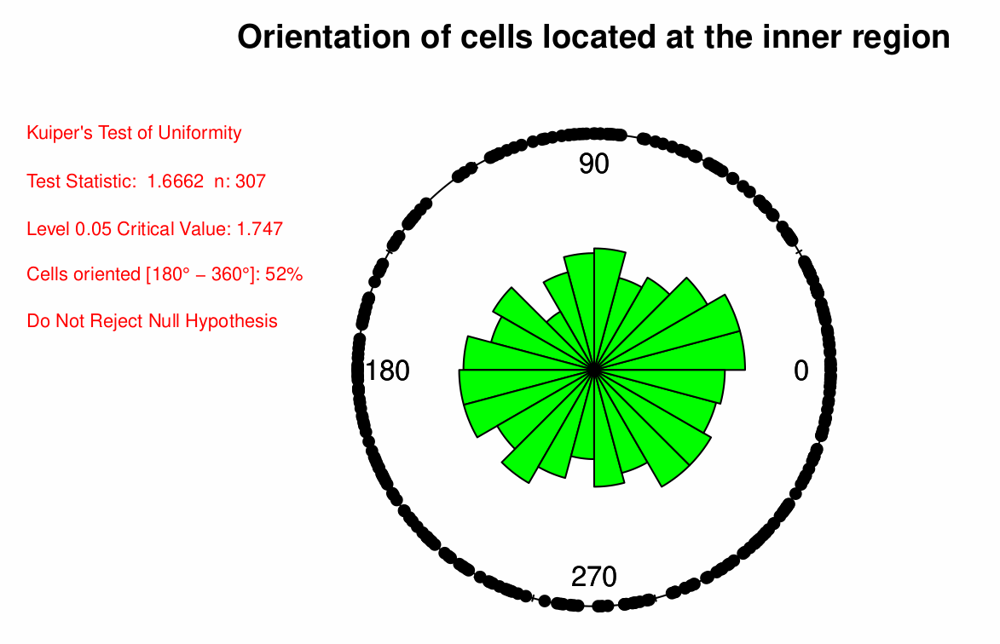
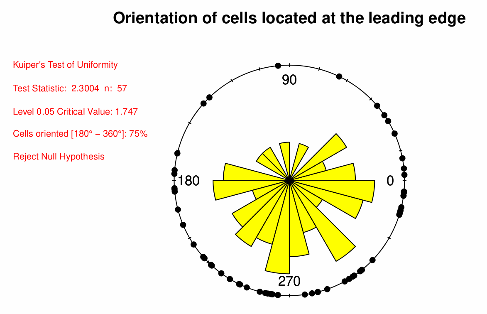
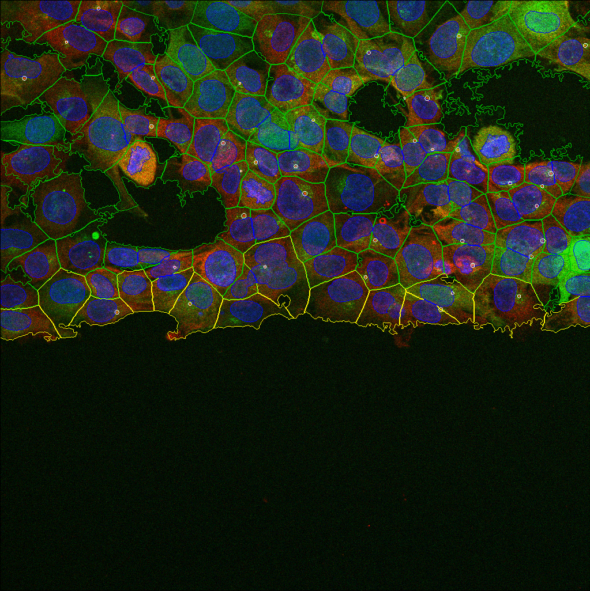

# Snakemake workflow: `CellOrientation`

[](https://snakemake.github.io)


## Test of Uniformity for centrosome orientation at early timepoints during [Wound Healing Assay](https://www.nature.com/articles/nprot.2007.30)

## Author

* [Raul Gomez Riera](https://orcid.org/0000-0003-4197-180X)

If you use this workflow in a paper, don't forget to give credits to the author by citing the URL of this repo.


## Image acquisition settings for data generation

The wound healing assay was combined with immunofluorescence of the centrosomal protein CEP170 and the Golgi marker GM130. Used fluorophores:
* Channel 0 : Centrosome marker CEp170, Alexa647
* Channel 1 : Golgi marker GM130, Alexa488
* Channel 2 : Nucleus, DAPI 

3D multiplex images (stack) of cells were acquired with Stellaris Falcon from Leica.
* Objective Immersion="Oil" LensNA="1.3"
* Model="HC PL APO CS2 40x/1.30 OIL"
* NominalMagnification="40"
* Voxel Size: 0.2841x0.2841x0.3462 um

Note: Images series were acquired along one leading edge of the wound and then along the second edge. The leading edge has to be centered and cell migration oriented top to bottom in the image field of view 

## Installation

You will need a current version of `snakemake` on Linux OS to run this workflow. To get `snakemake` please follow the install [instructions](https://snakemake.readthedocs.io/en/stable/getting_started/installation.html) on their website, but in brief once `conda` and `mamba` are installed you can install `snakemake` with:

```
mamba create -n snakemake -c conda-forge -c bioconda snakemake
```

Afterwards you can activate the `conda` environment and download the repository. And all additional dependencies will be handled by `snakemake`.

```
conda activate snakemake
git clone https://github.com/rgomez-AI/CellOrientation.git
```

### Enviroment creation

Create required environments by going to the directory `CellOrientation/workflow` 

where `Snakefile` is located and execute the following command:
```
snakemake --cores all --use-conda --conda-create-envs-only Data_Analysis
```

## Workflow Diagram

<p align="center">
  
</p>

A list of components used in this workflow `workflow/scripts`:

| Component       | Script                          | Description                                             |
|-----------------|---------------------------------|---------------------------------------------------------|
| split_channels  | lif2tif_split_proj_headless.ijm | Open .lif file serie <br> Z project (Standart Deviation) <br> Split channels and convert then into .TiF     
| CellProfiler    | Orientation.cppipe              | Detect centrosome and nucleus <br> Provide X, Y coordinates  <br> Classify cells based on its location                     |
| Data_Analysis   | DataAnalysis_headless.R         | Measure centrosome orientation <br> Perform statistical test of uniformity |


## Input

Acquired images (multichannel, Z stack and series) storaged in .lif format

Sample dataset provided by [Jennifer Jungfleisch](https://orcid.org/0000-0003-1063-9556) are images of human melanoma cells: [download](https://public-docs.crg.es/almu/rgomez/Jennifer_Jungfleisch/Dataset.zip)

## Running

To execute change current directory to the directory `workflow` where `Snakefile` is located.

```
snakemake --cores all --use-conda Data_Analysis
```

## Output

As an output there are two files:
* `results/INNERCells.pdf` which contain the analysis for cells
located at the inner region.

<p align="center">
  
</p>

* `results/OUTTERCells.pdf` which contain the analysis for cells
located at the edge region.

<p align="center">
  
</p>

To inspect the quality of image segmentation and centrosome detection visit
* `workflow/CP_OUT`

<p align="center">
  
</p>

## Report generation

For report generation snakemake required `pygments` module and it can be installed with:
```
pip install pygments
```
 
Afterward you can create a report file with the name *report.html* as the example bellow:
```
snakemake Data_Analysis --report report.html
```
